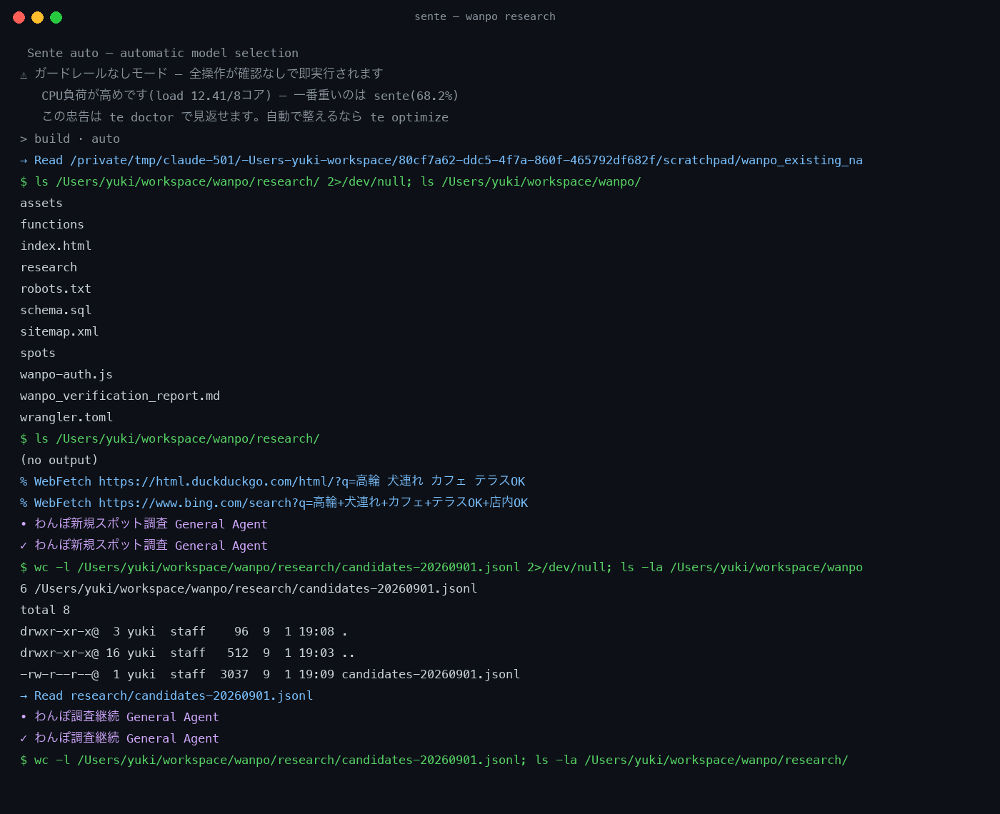
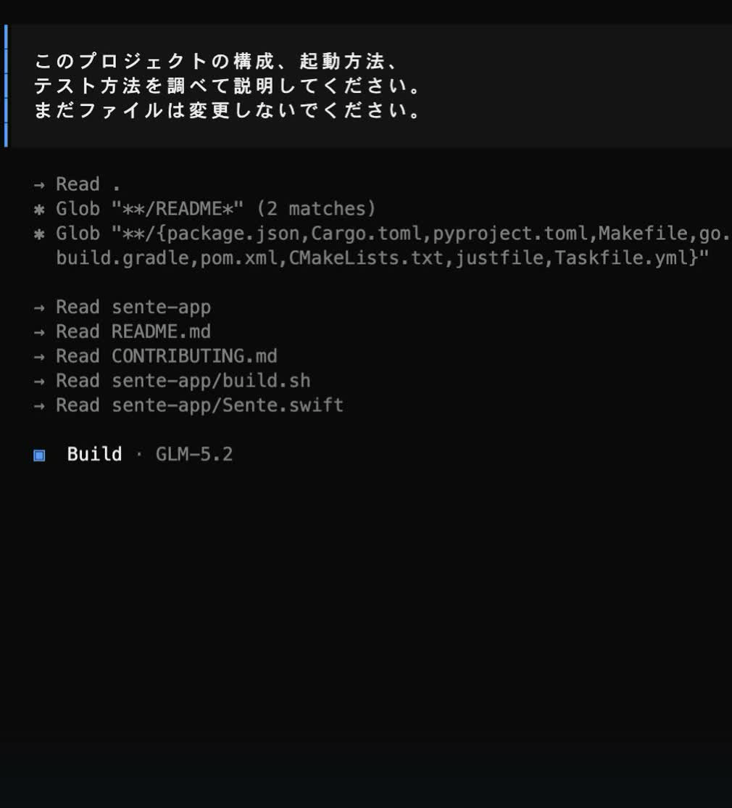

# Sente

### Describe what you want. Read the code. Make the change. Check it.

An AI coding agent you can use with text or voice. Start it in your project folder to investigate files, edit code and run commands. Switch the underlying model to suit the task, with Japanese and English workflows.

**[Get started](#start) · [Examples](#examples) · [Switch models](#models) · [Core source](https://github.com/yukihamada/opencode/tree/headless-model-fallback) · [日本語](./README.md)**



## Watch it (30 s, real recording)

[](https://teai.io/sente-tui-30s.mp4)

Not a re-created screen: this is a real Sente session given the example prompt from this README, run against this public repository.

```
Explain the structure of this project, how to start it and how to run tests. Don’t edit any files yet.
```

Sente opened `README.md`, `CONTRIBUTING.md`, `te-install.sh` and `Sente.swift` on its own and answered in Japanese (57.7 s measured). No file was changed. Narration uses the author’s KOE-cloned voice.

- [30-second version](https://teai.io/sente-tui-30s.mp4) · [15-second version](https://teai.io/sente-tui-15s.mp4)
- One request consumed 32.6 credits during the recording (about ¥5.4; ¥1 = 6 credits) across six exchanges on GLM-5.2. Cost varies with the model, the request and how much code is read. No speed advantage is claimed.

| When you need to… | Try asking… |
|---|---|
| Understand an unfamiliar repository | “Explain the structure, how to start it and how to run tests. Don’t edit anything yet.” |
| Fix a bug | “Reproduce the failure, fix the cause and run the relevant tests.” |
| Build a page or feature | “Improve this page on mobile and make the changes easy to review.” |
| Continue earlier work | Run `te resume` to reopen the previous session |

> This repository contains the **getting-started guide, launcher and macOS menu bar app**. The terminal UI and coding-agent core live in a separate [public repository](https://github.com/yukihamada/opencode/tree/headless-model-fallback).

<a id="start"></a>
## Get started

### 1. Install

Paste this into a terminal on macOS, Linux or Windows with WSL:

```sh
curl -fsSL https://teai.io/te | sh
```

Requires **`curl` and `python3`**. Follow the installer’s guidance for missing dependencies. A microphone is not required for text input.

To inspect the installer before running it:

```sh
curl -fL --max-time 120 https://teai.io/te -o sente-install.sh
less sente-install.sh
sh sente-install.sh
```

### 2. Register

```sh
te register
```

Enter your email address and the verification code you receive. Already registered? Use `te login`.

**The source code is MIT-licensed; AI, voice and other hosted services have separate usage costs.** This setup uses teai.io. See [pricing](https://teai.io/pricing) and run `te stats` to check your balance and usage.

### 3. Start in your project folder

Navigate to the project you want to work on, then run:

```sh
te
```

For your first request, type:

> Explain this project’s structure, startup instructions and test commands. Don’t change any files yet.

Once you understand the project, ask for a change. Review tool-execution prompts when they appear.

<a id="examples"></a>
## Give it real work

Use `te` for an interactive conversation or `te run` for a single task.

```sh
# Implement and verify a change
te run "Improve this page on mobile. Run the existing tests and explain the changes."

# Investigate and fix a bug
te run "Find the cause of the failing tests, make the necessary fix and rerun the relevant tests."

# Resume previous work
te resume
```

Include the **goal, target and definition of done**. For example: “Make login errors easier to understand. Match the existing design and check the failure state.”

Review the diff and test results afterwards. Dependencies, permissions and connected services affect which tasks can be completed.

<a id="models"></a>
## Switch the underlying model

Choose a model for a quick fix, a design discussion or a larger investigation without changing your working environment.

| Default terminal shortcut | Action |
|---|---|
| **F2 / Shift+F2** | Next / previous recently used model |
| **Ctrl+X, then M** | Open the model list |
| **F1** | Toggle spoken replies |
| **Shift+F1** | Help |

Bindings can differ by release or personal configuration. On a Mac, you may need to hold Fn when using function keys.

You can also select a model from the command line:

```sh
te models           # List available model IDs
te model            # Show the current default
te model teai/auto  # Use automatic selection by default
```

Use `te model <model-id>` to set a specific default. Copy an ID from the model list. Availability and pricing change, so this README does not maintain a fixed model ranking.

## Use your voice (optional)

```sh
koe                 # Continuous voice conversation; Ctrl+C to quit
te voice off        # Disable spoken replies
te voice on         # Enable spoken replies
te voice enroll     # Open the voice-registration page
```

Recording requires **a microphone and SoX**. Voice features also need a supported playback environment and service connectivity. Run `te doctor` to check dependencies. Voice registration is optional; you can work entirely with text.

<details>
<summary>Use the macOS menu bar app</summary>

```sh
te app install
```


The macOS app works with the terminal launcher. [Build instructions](./CONTRIBUTING.md) are also available.

</details>

## Building Sente with Sente

We use Sente to develop Sente itself, turning friction found in real tasks into improvements.

```text
Use it → find friction → change the code → test and measure → release the next version
```

This is what we mean by **recursive self-improvement**: a development loop in which people set goals and review changes. Installing Sente does not give it unconditional permission to rewrite or publish itself.

The aim is fewer round trips between a request and a finished result. Speed depends on the model, task and environment; no universal speed multiplier is promised.

## Troubleshooting

| Symptom | First step |
|---|---|
| `te: command not found` | Reopen your terminal, then check the PATH guidance printed by the installer |
| Authentication error | Run `te login` |
| Insufficient balance or unavailable model | Check `te stats` and `te models` |
| No sound or microphone input | Check `te doctor`, microphone permission and `te voice on` |
| Shortcuts differ from this guide | Check Shift+F1, Fn-key settings and your personal configuration |
| Need an update | Run `te update`, then restart Sente |

On Windows, start with the WSL instructions above. [Native core binaries](https://github.com/yukihamada/opencode/releases) are also available, separately from the shell launcher and macOS app.

## Source, data and contributing

| What you need | Where to find it |
|---|---|
| Installer and `te` launcher | [`te-install.sh`](./te-install.sh) |
| macOS menu bar app | [`sente-app/`](./sente-app/) |
| Terminal UI and agent core | [Public fork’s release branch](https://github.com/yukihamada/opencode/tree/headless-model-fallback) |
| Core binaries | [Releases](https://github.com/yukihamada/opencode/releases) |
| Bug reports and contributions | [CONTRIBUTING.md](./CONTRIBUTING.md) |

The core builds on [OpenCode](https://github.com/anomalyco/opencode). Copyright notices and licenses for the respective sources are retained.

With the standard teai.io setup, prompts and relevant code context are sent to external services for inference. Voice features also use KOE. Destinations depend on configuration; check `te privacy` and the [privacy policy](https://teai.io/privacy). Never include API keys or passwords in an issue.

The launcher here is a public snapshot. The installation URL fetches the current distributed version, which may differ from the file in this repository.

**MIT License** — [LICENSE](./LICENSE) / Vulnerability reports: [SECURITY.md](./SECURITY.md)

Developed and operated by Enabler Inc., Japan.
